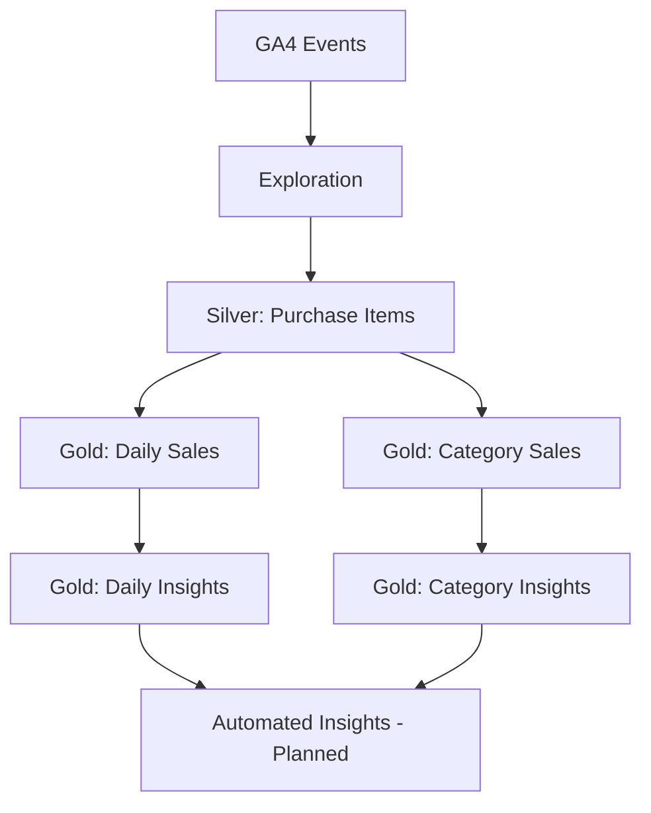

# GA4 E-commerce Analytics Pipeline

An end to end eCommerce analytics project using the public Google Analytics 4 ecommerce dataset in BigQuery.

The project transforms nested GA4 event data into analytical datasets using a layered architecture and prepares business-focused performance and revenue-driver metrics for downstream automated insights.

## Architecture



## Dataset

The project uses the public GA4 obfuscated sample ecommerce dataset:

`bigquery-public-data.ga4_obfuscated_sample_ecommerce.events_*`

The source contains nested and repeated fields such as:

- `ecommerce`
- `items`
- `event_params`

## Key Concepts

### GA4 Nested and Repeated Data

The source GA4 dataset contains repeated item-level data inside purchase events.

`UNNEST(items)` is used to transform the repeated `items` array into item-level rows.

This changes the grain from:

**1 row per event**

to:

**1 row per purchased item**

Care is taken not to double-count event-level metrics after item-level expansion.

## Data Layers

### Silver

`silver_purchase_items`

**Grain:** 1 row per purchased item

The Silver layer extracts and standardizes:

- Purchase date
- Purchase timestamp
- Transaction ID
- User ID
- Product
- Product category
- Item price
- Quantity
- Item revenue

### Gold

The Gold layer contains business-ready metrics.

#### Daily Sales

`gold_daily_sales`

**Grain:** 1 row per day

Metrics include:

- Revenue
- Orders
- AOV
- Units sold
- Unique customers

#### Category Sales

`gold_daily_category_sales`

**Grain:** 1 row per day per category

Metrics include:

- Revenue
- Orders
- AOV
- Units sold
- Unique customers

Missing or blank categories are normalized to `Unknown`.

#### Daily Insights

`gold_daily_sales_insights`

Adds day-over-day comparisons for:

- Revenue
- Orders
- AOV
- Units sold
- Customers

The table also includes data-quality flags for conditions such as low order volume and missing revenue.

#### Category Insights

`gold_daily_category_insights`

Adds day-over-day category performance and revenue impact.

A key metric is:

`revenue_change_amount = current_day_revenue - previous_day_revenue`

This is used alongside percentage change because percentage changes can exaggerate the importance of small categories.

## Analytics Approach

The project separates deterministic analytics from future AI-generated interpretation.

**SQL is responsible for:**

- Metric calculation
- Aggregation
- Day-over-day comparisons
- Revenue driver identification
- Data-quality checks

**AI will be responsible for:**

- Interpreting prepared metrics
- Summarizing important changes
- Generating business-oriented narratives

This separation keeps business-critical calculations deterministic and reproducible.

## Tools & Technologies

* **Google BigQuery:**  Data storage and analytical SQL
* **SQL:** Data transformation, data modeling, and business analytics
* **Visual Studio Code:** SQL development and project organization
* **Git & GitHub:** Version control and project documentation


## Project Structure

```text
ga4-ai-analytics/
│
├── README.md
│
└── sql/
    ├── 01_exploration/
    │   ├── 01_event_distribution.sql
    │   ├── 02_purchase_events.sql
    │   └── 03_purchase_items.sql
    │
    ├── 02_silver/
    │   └── silver_purchase_items.sql
    │
    └── 03_gold/
        ├── 01_gold_daily_sales.sql
        ├── 02_gold_daily_category_sales.sql
        ├── 03_gold_daily_sales_insights.sql
        └── 04_gold_daily_category_insights.sql

